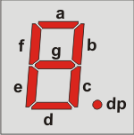

# Big 7 segment display boards

PCBs and Python driver for Raspberry Pi.

Uses the [TLC5916](http://www.ti.com/product/tlc5916), a constant current, 8 bit driver, designed for daisy chaining.

Check the video of it [in action on youtube](http://youtu.be/0-mJzARANds)

# PCB

Available from £6.50 from [me](http://www.mattvenn.net/2014/02/25/big-7-segment-display-pcb/).

Also available at a higher price from [OSH park](http://oshpark.com/shared_projects/hZyNfTTa), hopefully will find a way to make them cheaper soon!

# Python Example

    import driver
    driver.update("0.35") #requires 3 panels

# Electronics

*Important* Please read and understand the power supply pins below before connecting your board to a controller.

## Pins

1. Ground (0v).
2. Ground (0v).
3. +5v - The supply for the driver chip. This can be from 3.3v to 5v. It should be the same level as the logic levels of your controller. So for a Raspberry Pi which operates at 3.3v it should be connected to 3.3v.
4. +12v - The supply for the LEDs. Maximum 20V. Current is set with R1 (see notes below)
5. SDI/SDO - Serial Data In on the left of the board and Out on the right of the board (for chaining)
6. CLK - Clock. Next bit gets shifted when clock goes high.
7. LE - Latch Enable - the shift register is latched to the output when this is transitions from high to low.
8. !OE - Not Output Enable. Pulled up to the logic supply by a 500k resistor  in the chip. Pull low to turn on the LEDs. Useful for PWM control of brightness.

## LED arrangement

* A is bit 0 (gets clocked in first)
* G is bit 6
* Decimal point is bit 7 (gets clocked in last)

So `[ 1,1,1,1,1,1,0,0 ]` would be 0 with no decimal point.

## The driver chip: TLC5916

[Datasheet](http://www.ti.com/lit/ds/symlink/tlc5916.pdf) Overview

* 3.3v to 5v supply
* up to 120mA per channel
* Max LED voltage 20v

## Required Components - BOM

The long digit in the following list are Farnell order numbers

* R1: 2329486, 1, RESISTOR CARBON  1K0 0.25W 
* C5: 2112910, 1, CAP CER Y5V 1UF 50V RAD 
* C4: 1870987, 1, CAP ALU ELEC 22UF 6.3V RAD 
* C2: 1871001, 1, CAP ALU ELEC 220UF 16V RAD 
* IC1: 1647814, 1, IC LED DRIVER 8CH PDIP16

And 22 10mm LEDs of your choice.

## Optional Components

* 1101347, 1, SOCKET IC DIL 0.3" 16WAY 
* 1097954, 1, HEADER PIN TIN 36WAY 1ROW 

## Notes

1. R1 sets the LED current. 1k works well at 12v supply. The lower the value the higher the current provided to the leds. See page 18 of the [Datasheet](http://www.ti.com/lit/ds/symlink/tlc5916.pdf) 
2. For cost reasons, the caps in the above list are sold in 10s only.
3. For cost reasons, the header above will do 4 boards with a few left over.

## Characteristics

* with LEDs from [oomlout](http://oomlout.com) and a 1k current resistor, average current while counting is 120mA, all segments on is 200mA.
* current sourced from !OE is 22uA.
* current drawn by 5v line (logic supply) is 10mA.

# License

This hardware is licensed under the [CERN open hardware license 1.2](http://www.ohwr.org/attachments/2388/cern_ohl_v_1_2.txt), which also included in this repository.
